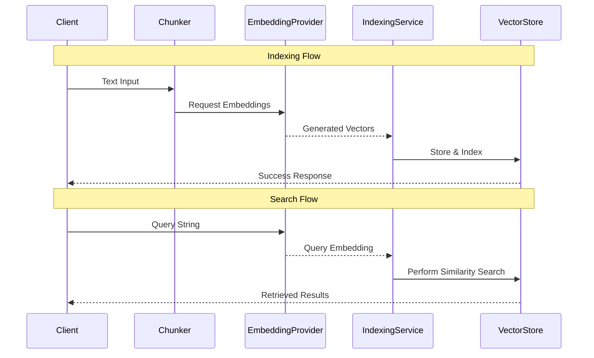

# RagEncoderApplication

A Spring Boot application designed for indexing text documents into a vector database and performing semantic searches using vector embeddings. This project is part of a RAG (Retrieval-Augmented Generation) pipeline, enabling efficient retrieval of relevant context from large datasets.

## Project Structure

The application follows a domain-oriented architecture where concerns are separated into clear boundaries:

- `api`: Contains REST controllers and Data Transfer Objects (DTOs).
- `chunking`: Handles the logic for splitting large documents into smaller, manageable chunks.
  - `AbstractChunker` / `TextChunker`
- `encoder`: Provides abstractions for generating vector embeddings from text.
  - `EmbeddingProvider` interface defines the contract for converting text into high-dimensional vectors.
  - `OllamaEmbeddingProvider` is an implementation that connects to an Ollama instance (e.g., using `bge-m3`).
- `index`: Orchestrates the indexing flow and manages interaction with the Vector Store.
  - `IndexingService` handles the workflow of chunking, embedding, and storage.
  - `VectorStore` abstracts vector database operations.
  - `QdrantVectorStore` provides a production-ready implementation using Qdrant.
- `scanner`: Responsible for file system interactions (scanning directories, reading files).
  - `FileScanner` handles identifying supported formats (`.txt`, `.md`, `.java`, etc.) and extracting content.
- `config`: Centralizes Spring configuration and property mapping.

## Data Flow

The core logic of the application revolves around two main flows: **Indexing** and **Searching**.



## Core Domain Classes

### Chunking
- **`Chunk`**: The base model representing a segment of text with associated metadata (ID, content, sourceId, chunkIndex, etc.).
- **`AbstractChunker / TextChunker`**: Provides strategies for splitting text based on character limits and overlap to preserve context between chunks.

### Encoder
- **`EmbeddingProvider`**: An interface defining the contract for converting text into high-dimensional vectors.
- **`OllamaEmbeddingProvider`**: Implementation that connects to an Ollama instance to generate embeddings.

### Indexing & Storage
- **`IndexingService`**: The primary orchestrator for data ingestion. It coordinates chunking, embedding generation, and storage while automatically enriching metadata with source information (filenames, file types).
- **`VectorStore`**: Interface for abstracting the vector database operations.
- **`QdrantVectorStore`**: Implementation providing production-ready search capabilities using the Qdrant database.

### Scanner
- **`FileScanner`**: Handles file system traversal, identifying supported formats and extracting content efficiently.

## API Reference

All endpoints are prefixed with `/rag`.

### 1. Generate Embedding
**Endpoint:** `POST /rag/embed`
Generates a vector embedding for a given piece of text.

**Request Body:**
```json
{
  "text": "Sample text to embed"
}
```

**Example Curl:**
```bash
curl -X POST http://localhost:8085/rag/embed \
  -H "Content-Type: application/json" \
  -d '{"text": "What is a vector database?"}'
```

### 2. Index Text
**Endpoint:** `POST /rag/index-text`
Indexes a raw string of text directly.

**Request Body:**
```json
{
  "sourceId": "doc_001",
  "text": "The content to index.",
  "metadata": {"category": "tutorial"},
  "collection": "documents"
}
```

**Example Curl:**
```bash
curl -X POST http://localhost:8085/rag/index-text \
  -H "Content-Type: application/json" \
  -d '{"sourceId": "doc_001", "text": "The content to index."}'
```

### 3. Index File
**Endpoint:** `POST /rag/index-file`
Processes a file from the local filesystem, automatically extracting its filename and type.

**Request Body:**
```json
{
  "path": "/Users/username/test.txt",
  "sourceId": "file_001"
}
```

**Example Curl:**
```bash
curl -X POST http://localhost:8085/rag/index-file \
  -H "Content-Type: application/json" \
  -d '{"path": "/Users/username/test.txt", "sourceId": "file_001"}'
```

### 4. Index Directory
**Endpoint:** `POST /rag/index-directory`
Scans and indexes all supported files in a directory.

**Request Body:**
```json
{
  "path": "/Users/username/data_folder"
}
```

**Example Curl:**
```bash
curl -X POST http://localhost:8085/rag/index-directory \
  -H "Content-Type: application/json" \
  -d '{"path": "/Users/username/data_folder"}'
```

### 5. Search
**Endpoint:** `POST /rag/search`
Performs a semantic search to find the most relevant chunks for a query. The response includes content, score, and metadata (sourceId, file name, etc.).

**Request Body:**
```json
{
  "query": "How do I use this library?",
  "limit": 5,
  "collection": "documents"
}
```

**Example Curl:**
```bash
curl -X POST http://localhost:8085/rag/search \
  -H "Content-Type: application/json" \
  -d '{"query": "How do I use this library?", "limit": 5}'
```

### 6. Delete Documents
**Endpoint:** `DELETE /rag/documents/{sourceId}`
Deletes documents associated with a specific source ID.

**Example Curl:**
```bash
curl -X DELETE http://localhost:8085/rag/documents/doc_001
```

### 7. Health Check
**Endpoint:** `GET /rag/health`
Checks the status of external dependencies (Qdrant, Ollama).

**Example Curl:**
```bash
curl -X GET http://localhost:8085/rag/health
```

## AI Usage Disclosure

AI tools were used to create this project with minimal human supervision and code review. Use this project at your own risk; some features may not work as expected.

Generated using:
* gemma4:12b-mlx
* codex / claude code
